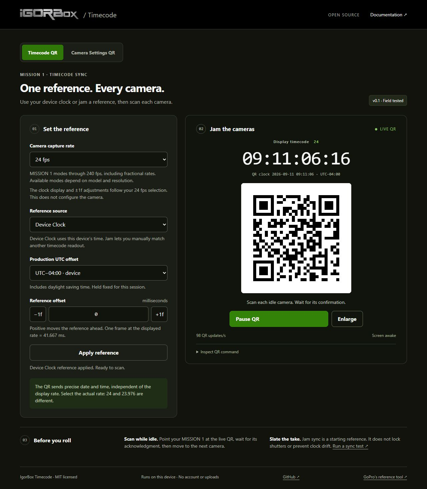

# IgorBox Timecode

**Use the app: [timecode.igorbox.com](https://timecode.igorbox.com/)**

Source: [RisingOrchards/gopro-timecode](https://github.com/RisingOrchards/gopro-timecode). Hosted on Vercel.

A small, static GoPro utility with two tools: **Timecode QR** (Device Clock or manual Jam) and **Camera Settings QR** (editable MISSION presets). No framework, build dependencies, backend, pairing, analytics or CDN. One vendored MIT QR encoder. The software is MIT licensed.



*Preview captured before the successful shoot report; the app now shows “Field tested.” Open [timecode.igorbox.com](https://timecode.igorbox.com/) to scan a current, animated QR.*

The app and documentation use IgorBox's forest green and warm charcoal palette, a black header and the locally bundled silver logo. Button shades are adjusted for readable contrast. The animated QR retains black modules and a white quiet zone for scanning. Branding can be replaced in `public/assets/igorbox-logo.png` and the two HTML headers; logo rights are separate from the code's MIT license.

**Timecode status: v0.1.0 · Field tested on a real MISSION 1 shoot.** On 2026-09-11, the project owner confirmed that the utility was used for a shoot and “worked perfectly.” Earlier testing also confirmed QR acceptance on a new, out-of-the-box MISSION 1 with stock firmware; **GoPro Labs installation is not required for that timecode workflow**. See the [field report](docs/HARDWARE_VALIDATION.md) for the reported results and a procedure for measuring offset and drift with your own setup.

The app uses the viewing device's clock or a manually matched reference; it does not receive LTC or automatically follow an external source. Protocol documentation was verified on 2026-09-09.

## Run

Open `public/index.html` directly for a local/offline copy, or use any static HTTP server. Node 22+ provides the included server and tests:

```sh
node scripts/serve.cjs
# http://127.0.0.1:4173
node --test tests/*.test.cjs
node scripts/check.cjs
```

No package installation is required. `npm start` and `npm test` are aliases. The optional `npm run build` (or `node scripts/build.cjs`) validates and copies `public/` to `dist/`; Vercel, GitHub Pages and Cloudflare Pages can serve `public/` directly. `private: true` prevents accidental npm publication, not open-source use. Modern Safari, Chromium or Firefox with canvas and animation frames is needed. Fullscreen/wake lock are progressive enhancements, usually requiring HTTPS or localhost. Offline use means downloading `public/`; this is not an installable PWA with an offline cache.

The local server listens on all IPv4 interfaces (`0.0.0.0`) and prints its network addresses. To open it on an iPad on the same network, use the computer's LAN address and port 4173. The ordinary HTTP LAN page supports the current QR workflow; browser features that require HTTPS, such as wake lock or a future audio input, may be unavailable there.

## Quick workflow

Use the **Timecode QR** tab for the clock workflow below. Use **Camera Settings QR** to configure capture settings first, then return to Timecode QR to jam.

## Camera Settings QR

**Requires GoPro Labs firmware for your camera model.** GoPro documents configuration QR commands as a [Labs firmware feature](https://gopro.com/en/us/info/gopro-labs). The successful stock-firmware timecode workflow does not enable these settings commands. With stock firmware, use the displayed values as a manual setup reference, then jam with Timecode QR. [Firmware downloads](https://gopro.github.io/labs/).

[Open Camera Settings QR](https://timecode.igorbox.com/settings.html). Set your **Capture target** at the top (default **8K 16:9 / 24 fps**), choose MISSION 1, MISSION 1 PRO or MISSION 1 PRO ILS, then pick a preset and edit any field. Generate displays a large static QR and the exact command. Copy Command, Reset and fullscreen are included; changing settings clears the previous QR. Optional Remember settings stores the target and form locally and always restores with the QR off.

**Production / Cinema**, **Run & Gun** and **Custom** follow the target: choose 4K30 and all three use 4K30; leave the default and they use 8K24. **Slow Motion** uses 4K60 and **High Frame Rate** uses 4K120, with a visible note whenever they override the target. All defaults use 16:9. Cinema, Run & Gun, Slow Motion and High Frame Rate use 10-bit GP-Log2, High bitrate and Low sharpness; choosing Custom starts with just the target and leaves other settings unchanged on-camera. Fields remain editable, including Open Gate where supported.

**Streaming / Live** prepares a mounted camera for HDMI capture: **4K 16:9**, the target rate through 60 fps (24 by default), **Natural color**, 10-bit, HLG Off, High recording bitrate, 5500K WB, 180° shutter, Auto ISO up to 800, Low sharpness and HyperSmooth Off. Targets above 60 fps use an explicit 60 fps preset override. Color stays editable for a live LUT workflow. [Preview the preset](docs/images/streaming-live.png).

Select clean 4K HDMI output on-camera and verify the actual signal received by your capture device. The preset sets camera capture options; it does not configure HDMI output, negotiate its rate/bit depth, or start a network stream. GoPro specifies [up to 4K60 output for the MISSION Media Mod](https://gopro.com/en/us/shop/mounts-accessories/camera-media-mod/AGFMD-001.html), while Labs HDMI display commands are not documented for MISSION. [HDMI streaming setup](public/guide.html#streaming-live).

Changing the target in Custom replaces resolution and frame rate while preserving other edits. Manual capture overrides are shown against the target. Unsupported resolution/rate pairs block generation instead of silently lowering the rate or resolution. Reset restores Cinema at the current target and clears the remembered form.

[Preview the Camera Settings QR screen](docs/images/camera-settings.png).

Supported video controls include resolution/aspect, rate modes through 240, depth, color, Standard/High bitrate, shutter angle, ISO ceiling or fixed ISO, discrete WB, sharpness, EV, HyperSmooth and denoise. Photo offers mode, RAW, WB and EV. Compatibility validation checks the model, resolution/rate pairs, GP-Log2 depth, ISO/shutter/EV interactions and ILS lens requirements. The new settings tool has documented command support and software/browser tests; its camera scan acceptance is separate from the field-tested timecode tool.

**Key differences from camera-menu shorthand:** 24/30/60 mode labels follow existing camera timing and may be fractional. Shutter uses documented angles, not direct speed extensions. WB includes 5500K rather than an invented 5600K command. Independent ISO minimum, Max/custom Mbps and unverified stabilization combinations are omitted. Settings QR requires model-specific Labs firmware; Timecode QR works on stock MISSION 1 firmware as field tested.

**“Timecode not synced” while scanning a settings QR:** on 2026-09-11 the project owner reported this message on original GoPro firmware, with no settings applied. Treat this as a failed configuration scan. The likely explanation is the stock timecode reader rejecting a Labs settings command; the exact firmware error path has not been independently confirmed. Set capture options manually on stock firmware, or use model-matched Labs firmware for configuration QR. See [troubleshooting](public/guide.html#settings-timecode-error).

See [camera-settings research, preset commands and omissions](docs/CAMERA_SETTINGS.md) and the [usage guide](public/guide.html#camera-settings). Reset restores the local form; it sends no camera-reset command. No backend or new package dependency is added.

## Timecode workflow

**Defaults:** Device Clock, 30 fps camera capture and a 30 fps display. Device Clock's **Display timecode** and ±1f adjustments follow **Camera capture rate**: choosing 24 displays frames 00–23 and makes one frame 41.667 ms. **Source Timecode Rate** appears only when **Jam** is selected and initially uses 30. Switching back from Jam restores the selected capture display rate. The camera capture selector includes 24, 25, 30, 50, 60, 100, 120, 200 and 240 fps mode families, with fractional choices 23.976, 29.97, 59.94, 119.88 and 239.76. For 8K/60, choose your actual 60 or 59.94 capture mode. Available modes depend on model and resolution; see [GoPro’s specs](https://gopro.com/en/us/shop/buy-cameras/mission-1-series).

**The display rate does not configure camera timecode.** The QR contains date/time, with no frame-rate command. Device Clock's high-speed frame counts are display previews; they do not assert that a clip has a 120 or 240 fps timecode track. Counts above 99 use three digits, such as `12:00:00:120` halfway through a second at 240 fps. A screen may skip displayed frame numbers when the capture rate exceeds its refresh rate. Fractional displays use the NDF convention described below and can differ from wall-clock seconds; the QR clock remains unchanged.

Under **Jam**, the **Source timecode** readout and ±1f adjustments follow the source rate independently of capture. For example, 240 fps capture and a 60 fps Jam source gives four captured frames per timecode frame. Set Source Timecode Rate to the actual source rate. Jam supports source labels through 60 fps and NDF only; do not select NDF against a drop-frame source. Verify original and slow-motion/conformed clips separately.

Changing **Camera capture rate** keeps the reference clock running. A live QR continues updating; a paused QR stays paused, with Start QR available. The applied reference, offset and timezone are preserved in both Device Clock and Jam. Changing the actual **Source Timecode Rate** in Jam still requires a fresh manual match; changing capture rate cannot reactivate an invalidated reference.

1. Use your MISSION 1 with its stock firmware and select the intended capture mode. Check its acknowledgment of the live QR. Set the capture selector to the actual rate; confirm original test-clip metadata because menu labels can hide fractional rates.
2. Leave **Device Clock** selected to use the current time on the device showing this page. Confirm the production UTC offset and start with a **0 ms** reference offset.
3. To match a different reference, select **Jam**, set **Source Timecode Rate**, enter a future timecode and press **Jam now** when that source reaches it. Manual matching includes reaction time.
4. Use milliseconds or ±1f to adjust, then apply the reference. Positive offset advances the QR clock. The selector only changes the reference math; it does not configure cameras. Settings reset on reload.
5. Start the QR and show it to each idle camera. Wait for on-camera acknowledgment, then move the camera away. The browser cannot know whether the camera accepted it. Scan the animation, never a screenshot.
6. Record a slate/clap and verify initial alignment and end-of-take drift. Re-jam before setups and after power, battery or frame-rate changes. Backgrounding pauses the QR and requires reapplying the reference.

Switching from Jam back to **Device Clock** immediately restores the live clock with the displayed offset. The hidden Jam rate no longer affects it. The QR remains stopped until **Start QR** is pressed.

Use the included [Documentation](public/guide.html) for Device Clock and Jam workflows, a MovieSlate example, MISSION 1 + Premiere Pro instructions, drift measurement and troubleshooting. It is linked in the app and remains available offline.

### Example: MovieSlate on the same iPad

Set MovieSlate to **Clock / Wall Clock** and use **Device Clock** here on the same iPad, with the device timezone and zero offset. Both use the iPad's time reference, so a manual match is unnecessary. For a true 24.000 fps production, select 24 in MovieSlate and 24 as the camera capture rate here; both readouts then use frames 00–23. At the same instant, `12:00:00:12` at 24 fps and `12:00:00:15` at 30 fps both represent half a second past noon. Check the clip's actual rate: GoPro documents nominal 24 as 23.976 by default, with true 24 available separately through [Labs extensions](https://gopro.github.io/labs/control/extensions/). The [MovieSlate user guide](https://www.movie-slate.com/ms_online/UserGuide/HTML_docs/help_hd.html?block_526=) documents its wall-clock source and fractional NDF limitations. Confirm actual camera alignment with a slate test.

The page uses the viewing iPad's clock even when hosted by another computer or Vercel. It makes no internet time request. Returning from another app requires **Apply reference**, then **Start QR**. At fractional NDF rates, check numbering explicitly; a shared wall clock does not resolve a DF/NDF mismatch. Use Jam for custom or external timecode. See the [same-iPad example](public/guide.html#movieslate-example).

Automatic matching from MovieSlate Pro is feasible via a wired LTC audio input and a future browser decoder. It is not implemented in this release. See [automatic-sync research](docs/AUTO_SYNC.md) for the verified signal path, documented LTC-rate limit, same-device constraints and validation needed.

## What was verified

- **Real shoot:** the project owner reported successful use of the MISSION 1 sync workflow on 2026-09-11. This follows the stock-firmware QR acceptance report on 2026-09-09. See the [field report](docs/HARDWARE_VALIDATION.md).
- GoPro’s [current Labs matrix](https://gopro.github.io/labs/) marks **Time/date/timecode QR Code** supported for MISSION 1 / MISSION 1 PRO. This documents Labs compatibility; it does not imply Labs is required. The project owner's stock MISSION 1 acceptance report is separate field evidence.
- The [Precision Time page](https://gopro.github.io/labs/control/precisiontime/) animates a date/time QR. Its older May 2025 compatibility footer omits MISSION; the newer main matrix explicitly includes it.
- The [command reference](https://gopro.github.io/labs/control/tech/) and [generator source](https://github.com/gopro/labs/blob/master/docs/control/precisiontime/README.md) establish the payload format. See [research notes](docs/RESEARCH.md) for the evidence, assumptions and limitations.

```text
oTYYMMDDhhmmss.sssoTD0oTZ<timezone>oTI0

# Example: September 9, 2026, 13:00:00.125, UTC
oT260909130000.125oTD0oTZ0oTI0
```

`oT` uses camera-local calendar fields with three millisecond digits. `oTZ` accepts signed hours or minutes; this app sends hours for integral-hour zones and minutes otherwise. Its fixed production offset already includes DST, so `oTD0` avoids double counting. `oTI0` follows the current official generator; no extra meaning is assumed. No frame rate, record control, `TCAL`, or persistent camera customization is sent. A scan changes the camera’s date/time and timezone information, not merely this app’s display.

## Timecode model

Rates are represented as exact rationals, not rounded decimal clocks:

| Selection | Actual frames/second | Label base | Frame duration |
|---|---:|---:|---:|
| 23.976 NDF | 24000/1001 | 24 | 41.708333 ms |
| 24 | 24 | 24 | 41.666667 ms |
| 25 | 25 | 25 | 40 ms |
| 29.97 NDF | 30000/1001 | 30 | 33.366667 ms |
| 30 (default) | 30 | 30 | 33.333333 ms |
| 50 | 50 | 50 | 20 ms |
| 59.94 NDF | 60000/1001 | 60 | 16.683333 ms |
| 60 | 60 | 60 | 16.666667 ms |

For elapsed milliseconds `t` since the QR clock’s local midnight:

```text
frameCount = floor(t × numerator / (1000 × denominator))
```

Format that frame count in the nominal label base. At wall time 01:00:00.000, 29.97 NDF yields `00:59:56:12`, not `01:00:00:00`. This numbering effect is separate from oscillator drift. MovieSlate clock mode may use a different starting convention; compare readouts or match manually instead of assuming equal “TOD” settings mean equal TC.

Manual matching inverts the equation to find a QR clock timestamp at the beginning of the requested frame, rounded up to a representable millisecond. For `01:00:00:00` at 29.97 NDF it encodes a QR clock starting at `01:00:03.600`. The adjusted QR clock then advances in real milliseconds using `performance.now()`. The visible “QR clock” exposes that deliberate offset.

**Midnight:** a daily GoPro clock mapping resets at QR midnight. Fractional NDF has not yet reached 24 nominal hours at that point; the last approximately 86 seconds of nominal labels cannot be represented. Manual matching rejects that unreachable range, and manual references stop at a QR-date rollover. Device-clock mode follows the daily reset. This utility does not claim uninterrupted arbitrary SMPTE free-run across midnight.

True 24/30/60 camera timecode uses an integer clock model derived from integer capture support and the time-of-day model. The successful shoot report confirms the workflow in production; rate-by-rate MP4 timecode measurements were not supplied. GoPro documents [24HZ and ALLI](https://gopro.github.io/labs/control/extensions/) for integer capture. Check actual file rate and embedded timecode when using a new capture mode.

## Accuracy, jam sync and genlock

QR jam establishes an initial time relationship; cameras then free-run. It does not genlock sensor readout/exposure cadence, continuously distribute timecode, discipline oscillators or fix drift within a clip.

No ±1-frame or hourly-drift guarantee is made. Measure start/end slates over 30–60 minutes with your exact firmware, display and settings. Compare initial offset separately from the change over time. Repeated measurements determine the usable re-jam interval. Example only: 10 ppm relative drift is 36 ms/hour, approximately 1.08 frames at 29.97.

QR updates follow animation frames with fresh timestamps. There is no invented latency compensation. The QR has error correction M and a four-module white quiet zone. It is hidden on pause, reference edits, backgrounding, restore, clock jumps over 250 ms, display stalls over 200 ms and rendering over 100 ms. The informational Camera capture rate control does not pause it. A browser/OS freeze can retain old pixels until code runs again, so these are detection measures, not a real-time guarantee. Do not scan a frozen display. Millisecond fields do not imply millisecond physical accuracy.

## Premiere Pro

Import original clips and verify actual rates and starting timecodes. Choose **Use Media Source** for timecode display. Select clips in the Project panel, then **Clip → Create Multi-Camera Source Sequence → Timecode**. Preserve hour matching for a shared reference. Check clap/slate alignment at both ends. If media lacks usable embedded timecode, align using a clap, clip markers or common audio and resolve the acquisition problem; this app does not write metadata into files. Independently sync any separate audio recorder.

Sources: Adobe’s [source timecode display](https://helpx.adobe.com/premiere/desktop/organize-media/apply-labeling/choose-timecode-display-format.html) and [multicamera workflow](https://helpx.adobe.com/premiere/desktop/edit-projects/set-up-multi-camera-sequences-for-editing/create-a-multi-camera-source-sequence.html); MovieSlate’s [keypad instructions](https://www.movie-slate.com/FAQs/10544/9/10/) and [rates](https://www.movie-slate.com/slate/).

## Hosting

All paths inside `public/` are relative, including the guide, so the app works below a repository path. Only deploy `public/`; the source, tests and hosting metadata need not be publicly served.

### Vercel

The production app is live at **[timecode.igorbox.com](https://timecode.igorbox.com/)** on Vercel. The included `vercel.json` selects no framework, skips package installation, validates the static files and publishes `public/`.

To deploy your own copy, import your repository into Vercel or run `vercel deploy` from this directory after signing in with Vercel CLI. Test with the project's `.vercel.app` address, then add your domain in the Vercel project settings and apply the DNS records Vercel provides. Update the HTML canonical URLs and package homepage for a separately hosted fork. See [Vercel deployment](https://vercel.com/docs/cli/deploying-from-cli) and [domains](https://vercel.com/docs/cli/domains).

Pages request `noindex, nofollow` for a discreet deployment. `robots.txt` allows crawlers to read the sharing metadata, images and indexing instructions. These are indexing preferences, not authentication: anyone with the public URL can open the app. See [Google's noindex guidance](https://developers.google.com/search/docs/crawling-indexing/block-indexing).

### Link previews and share images

Both pages include [Open Graph metadata](https://ogp.me/) and an X/Twitter large-image card, with absolute production URLs and image descriptions. The same assets can be shared manually:

- [Landscape card, 1200 × 630](public/assets/og-image.png) — used for automatic link previews.
- [Square share card, 1080 × 1080](public/assets/share-card.png) — for image posts and other square placements.

The artwork's QR opens **https://timecode.igorbox.com/**; it contains no camera clock-setting command. The animated QR inside the app performs time sync.

Editable artwork is in `docs/social/`. Run `node scripts/social-card.cjs` to regenerate both SVGs using the existing logo and vendored QR encoder. To also regenerate PNGs, use `--png` in a tooling environment with `sharp` installed. PNGs are checked in, so ordinary builds and hosting require no image tooling or added dependencies. The layout uses system sans-serif fonts; it does not bundle IgorBox's website font.

Link previews become available after these files are pushed and deployed. Platforms may cache a previous preview; a cached result does not update until that platform fetches it again. The included static check validates page metadata, local image existence and PNG dimensions; platform-specific preview rendering must be checked after deployment.

### GitHub Pages

For an alternative to Vercel, choose **Settings → Pages → Source → GitHub Actions**, then manually run **Publish GitHub Pages** from the repository's Actions tab. The optional `.github/workflows/pages.yml` tests the app and uploads `public/`; it does not publish automatically on push. No bundling or package installation. The separate CI workflow checks pushes and pull requests. Publishing audience is determined by your GitHub Pages settings. See [GitHub’s publishing-source guide](https://docs.github.com/en/pages/getting-started-with-github-pages/configuring-a-publishing-source-for-your-github-pages-site).

### Cloudflare Pages

Import the repository, choose framework **None**, production branch **main**, build command **`exit 0`**, and output directory **`public`**. Or use Direct Upload with the contents of `public/` at the upload root. No Functions, environment secrets or account integration. See [Cloudflare’s static HTML guide](https://developers.cloudflare.com/pages/framework-guides/deploy-anything/). The optional `_headers` file sets a same-origin content policy; GitHub Pages ignores it.

The optional `node scripts/build.cjs` produces a plain `dist/` copy for hosts that prefer that directory. No hosting account or project identifier is included in the source.

## Repository layout

```text
public/                 Deploy this directory; also opens directly
  index.html            Working surface
  app.js                UI and timing lifecycle
  settings.html         Camera Settings QR tool
  settings-app.js       Camera form and local state
  settings-core.js      Pure settings validation and command generation
  settings-presets.js   Editable starter preset data
  settings-capabilities.js  Model tables and command allowlists
  core.js               Pure reference/timecode/payload math
  qr.js                 Canvas renderer
  guide.html            Offline documentation
  assets/               Locally bundled IgorBox branding
  vendor/               Pinned qrcode-generator 1.4.4 + MIT notice
tests/                  Node built-in tests; no dependencies
scripts/                Local server and static integrity check
docs/                   Research, field report and drift measurement guide
.github/workflows/      CI and optional GitHub Pages publication
```

Contributions should preserve the plain static app and keep protocol/timebase logic testable. Report hardware results with the model, firmware, rate, zone, display, initial error and end error. Never present a browser-side test as a camera sync measurement.

## License

The software and original documentation are released under the **MIT License**. See [LICENSE](LICENSE). The vendored QR encoder is also MIT licensed; retain its separate copyright notice in [THIRD_PARTY_NOTICES.md](THIRD_PARTY_NOTICES.md) and `public/vendor/qrcode.LICENSE`.

The supplied IgorBox logo and trademark are excluded from the software license. Replace branding for separately branded forks. GoPro firmware/docs are not bundled or relicensed. This project is not endorsed by GoPro, MovieSlate/PureBlend Software or Adobe.

No credentials, deployment account identifiers or environment files are required. Keep local credentials and hosting metadata out of commits; `.gitignore` excludes `.env*`, `.vercel/`, `.openai/` and logs. Deploy only `public/`, which contains both tools, documentation and local assets. The app makes no network requests for timecode and stores no calibration or personal data. Camera form settings are saved in local storage only when Remember settings is enabled; Reset clears that saved form.
